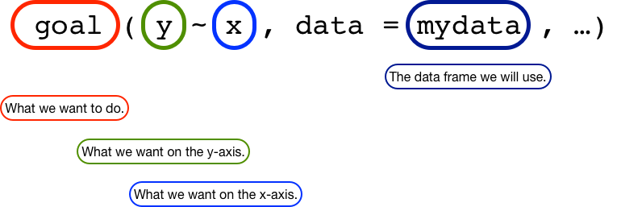

```{r setup, include=FALSE}
knitr::opts_chunk$set(echo = TRUE)
```

## Introduction

In this lab, you will explore a (fake!) data set of the attributes of students in a MA 151 course. In the process, you will learn how to:

1. Organize your work in R.
2. Create and use an RMarkdown file to store your work.
3. Load and inspect a data frame.
4. Compute summaries of 

## Setting Up a Directory for MA 151

It is a good idea to save all of the files you will create in R in an organized fashion. You may already have an organizational system for your files from previous courses. If so, feel free to use that system, since you are already familiar with it.

If you do not have an organizational system for your files, I recommend using the Documents folder on your computer as home base, and then creating a folder for MA 151, sub-folders for homeworks and labs, etc. So your file system should look like:

```
Documents
  ma151
    hw
      hw1
    labs
      lab1
```

R can be finicky in how it reads in files. Windows, macOS, and Linux allow you to do some crazy things with file names, but you should aim to keep your file names as vanilla as possible.

As a rule:

- Avoid spaces in file names. R may get confused, since spaces are also used to separate commands.
- Avoid special characters (-, +, _, %, etc.) in file names. Again, R may get confused.
- Put all of files for a given assignment in the same directory. This should include the <tt>.Rmd</tt> file, the <tt>.Rda</tt> file, any additional notes you might write, etc.

## Creating a New RMarkdown File

You will need to create an RMarkdown file to store your work. RMarkdown files are plain text files containing R code that RStudio can interpret, execute, and use to embed graphics, tables, etc.

To create a new RMarkdown file, select

```
File > New File... > RMarkdown ...
```

from the File menu at the top of your screen.

You will be prompted with a dialog box to give a title to your RMarkdown file, and to add your name as author. You can leave all of the remaining options at their default values.

You should save the file using

```
File > Save
```

name it <tt>lab1.Rmd</tt>, and save it in the <tt>lab1</tt> folder you created in the previous section.

## Downloading the Data

You can find the data listed under today's date on the course website, or from [this link](https://github.com/ddarmon/master/raw/master/teaching/MA-151-FA19/lesson-plans/1/SynthCourseStats.rda).

The data is stored in <tt>SynthCourseStats.rda</tt>. The file has the suffix <tt>rda</tt> file, which stands for **RDa**ta Format. This is similar to the <tt>.xls</tt>, <tt>.doc</tt>, etc., suffixes you may be familiar with from Microsoft Excel, Microsoft Word, etc. It tells your computer that this type of file should be opened by a program that can read R files.

You should **move <tt>SynthCourseStats.rda</tt> to the lab1 folder you have already created**.

## Writing Code Chunks in RMarkdown

In RMarkdown, we can mix plain text with R code. We need to tell RMarkdown how to recognize when a chunk of text should be interpretted as plain text (something a person can read) versus R code (something the computer can read). RMarkdown does this this using "code chunks," which are separated from the main text by a block like this:

<div class="highlighter-rouge"><div class="highlight"><pre class="highlight"><code>```{r}

```</code></pre></div></div>

The <tt>`</tt> symbol is [grave accent](https://en.wikipedia.org/wiki/Grave_accent) and can be found on the top left of the keyboard, just below the Escape key. So any time you see a block of code like this:

```{r}
# Block of code
```

you should put it inside of a code chunk in RMarkdown like this:

<div class="highlighter-rouge"><div class="highlight"><pre class="highlight"><code>```{r}
# Block of code
```</code></pre></div></div>

## Loading Data

We will begin our data analysis by loading in the data file into RStudio. You can do this with the load command:

```{r}

load('SynthCourseStats.rda')

```

You can then run this code chunk by clicking on the green play button on the right of the code chunk.

Assuming you are in the correct working directory, RStudio will now load in the <tt>course.stats</tt> data frame. If you get an error, it's most likely because R is not looking in the correct directory. If this happens, select

```
Session > Set Working Directory > To Source File Location
```

and the working directory (where R looks for files) will now be set to the correct folder. Rerun the code chunk and the data frame should load. If you still cannot get the data frame to load, raise your hand and I will troubleshoot the issue with you.

## Inspecting a Data Frame 

We can inspect the first few rows of the <tt>course.stats</tt> data frame using the <tt>head</tt> command in R. "Head" here means the top; there is a corresponding command <tt>tail</tt> which will print the last few rows of a data frame.

```{r}

head(course.stats)

```

## Installing and Loading <tt>mosaic</tt>

To create histograms, density plots, etc., we need to install the <tt>mosaic</tt> package. To install a package in R, you use the <tt>install.packages</tt> command. So to install <tt>mosaic</tt>, create a code chunk with the following command and run it:

```{r, eval = FALSE}

install.packages('mosaic')

```

You only need to do this once per computer that you will be using R on. After a package is installed, it will remain installed on that computer. RStudio will also warn you if you try to run an RMarkdown file with uninstalled packages.

To load a package into R, you use the <tt>library</tt> command. So to load the <tt>mosaic</tt> package into R, you should create and run the code chunk:

```{r, message = FALSE}

library(mosaic)

```

Now all of the functionality of <tt>mosaic</tt> is available to you.

## Using <tt>tally</tt> to Aggregate Data

Let's use some of <tt>mosaic</tt>'s functionality to explore the <tt>course.stats</tt> data frame. We will use the <tt>tally</tt> function to summarize the distribution of majors in this MA 151 class.

Remember that the "grammar" of functions in <tt>mosaic</tt> follows the structure



Since we want to tally the students by their major, and the data is stored in the <tt>course.stats</tt> data frame, the command we want to use is

```{r}

tally(~ major, data = course.stats)

```

We can also pass additional arguments to an R function, to change how it presents its output. So, for example, to output the tally in terms of the proportion of students by major, we can pass <tt>'proportion'</tt> to the <tt>format</tt> argument:

```{r}

tally(~ major, data = course.stats, format = 'proportion')

```

To output the tally in terms of the percentage of students, we use <tt>percentage</tt>:

```{r}

tally(~ major, data = course.stats, format = 'percent')

```

## Generating Histograms from Data

One of the things students care (perhaps too much) about is their grade on an exam, and the distribution of grades on the exam across the entire class. We can visualize the distribution of the Midterm 1 scores in the class using a histogram:

```{r}

gf_histogram(~ midterm.1, data = course.stats)

```

Notice that this is exactly the same grammar as we used for the <tt>tally</tt> command, but now we are asking about the <tt>midterm.1</tt> variable in the data frame.

Suppose the professor used a standard ten point scale to assign letter grades to the exam scores. The bins that <tt>gf_histogram</tt> used by default make it difficult to determine the number of students who earned an A versus a B versus a C, etc., on the exam. We can use the <tt>binwidth</tt> and <tt>boundary</tt> arguments of <tt>gf_histogram</tt> to set the bins to have a width of 10, and to start the bins at 0:

```{r}

gf_histogram(~ midterm.1, data = course.stats, binwidth = 10, boundary = 0)

```

We can also add a rug plot to the histogram, to display the actual scores of the students, using the <tt>gf_rugx</tt> command. To add an element to a plot, you use the <tt>%<%</tt> operation:

```{r}

gf_histogram(~ midterm.1, data = course.stats, binwidth = 10, boundary = 0) %>% gf_rugx(~ midterm.1)

```

Finally, we can break down the distribution of Midterm 1 scores by-major using the <tt>|</tt> (vertical bar or "pipe") character. You will learn later in this course that, in writing mathematical expressions involving probabilities, the vertical bar denotes "given," so "<tt>midterm.1 | major</tt>" can be read as "break down the Midterm 1 scores given that we know the major of a particular student":

```{r}

gf_histogram(~ midterm.1 | major, data = course.stats)

```

## Generating Density Plots from Data

Histograms are easy to understand, but suffer from the fact that the choice of bin width can drastically change the appearance of a histogram. A density plot is a "smoothed" histogram that avoids this problem. We can create a density plot for the Midterm 1 grades and add a rug plot using:

```{r}

gf_dens(~ midterm.1, data = course.stats) %>% gf_rugx(~ midterm.1)

```

Again, notice how this uses the same grammar as <tt>tally</tt> and <tt>gf_histogram</tt>.

Finally, we can break up the distributions by major as before:

```{r}

gf_dens(~ midterm.1 | major, data = course.stats) %>% gf_rugx(~ midterm.1)

```

If we want to show all of densities overlayed on the same plot, we can use the <tt>color</tt> argument of <tt>gf_dens</tt>:

```{r}

gf_dens(~ midterm.1, color = ~ major, data = course.stats)

```

## Including Additional Information Using <tt>tally</tt>

Let's return to <tt>tally</tt>, and see what happens when we use the pipe operation to break down the <tt>course.grade</tt> (the letter grade for each student in the course) variable by <tt>major</tt>:

```{r}

tally(~ course.grade | major, data = course.stats)

```

<tt>tally</tt> is telling us that 5 biology majors got Bs, 3 biology majors got Cs, 1 chemistry major got a B, etc. (Reminder: these data are **fake**.)

We can also use the <tt>format</tt> argument to break down the distribution of grades by major:

```{r}

tally(~ course.grade | major, data = course.stats, format = 'percent')

```

So we see that amongst biology majors, 62.5% got Bs, and amongst health majors, 50% got Bs, etc.

## Knitting an RMarkdown File

Now that you've completed the lab, you can "knit" the RMarkdown file together into an HTML file using the R package <tt>knitr</tt>. To do this, either select

```
File > Knit Document
```

from the File menu, or click the Knit icon in the ribbon of the Rmd file (the blue ball of yarn).

This will create a file called <tt>lab1.html</tt> that contains all of the code chunks you wrote and the tables and plots they generated.